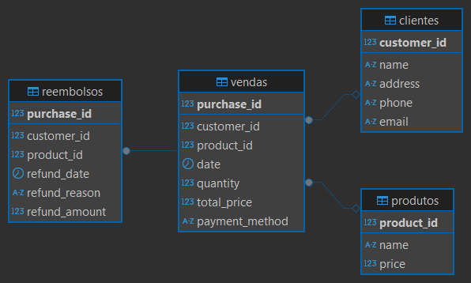

# 🛍️ Projeto dbt — ShoesBR

Este projeto modela os dados de um e-commerce fictício chamado **ShoesBR**, utilizando o **Data Build Tool (dbt)** para transformar, documentar e testar dados de forma estruturada, modular e analítica.

O objetivo é oferecer uma visão completa **End-to-End (E2E)** do fluxo de engenharia de dados: desde a ingestão e modelagem até o deploy, documentação e orquestração em nuvem.

---

# 🎯 Objetivo do Projeto

Construir um **Data Warehouse analítico** organizado em camadas, seguindo as boas práticas recomendadas pela dbt Labs.  
A arquitetura proposta permite:

- Transparência nas transformações  
- Reprodutibilidade  
- Testes automatizados  
- Documentação viva  
- Deploy e agendamento em nuvem  

Este projeto também serve como material educacional para estudantes de engenharia de dados.

---

# 📁 Fontes de Dados

Na pasta `shoesbr/scripts-sql` estão os scripts responsáveis pela criação das tabelas utilizadas no projeto.

> **Observação:** A tabela de **estornos** é materializada a partir de um arquivo CSV localizado na pasta `seeds/`.

---

# 🧬 Diagrama Relacional das Tabelas de Origem



---

# 🧱 Boas Práticas por Camada no dbt

## 🔹 Camada `staging`

| Prática recomendada | Descrição |
|---------------------|-----------|
| Prefixo `stg_` | Nomeie os modelos como `stg_<tabela>` |
| Seleção explícita | Evite `SELECT *` |
| Padronização | Use `snake_case` |
| Limpeza básica | Trate nulos, tipos e duplicatas |
| Sem regras de negócio | Apenas padronização |
| Uso de `source()` | Referencie dados brutos |
| Organização por fonte | Subpastas por origem |
| Testes | Unicidade, nulos, integridade |
| Documentação | `.yml` descrevendo tabelas e colunas |

---

## 🔸 Camada `intermediate`

| Prática recomendada | Descrição |
|---------------------|-----------|
| Prefixo `int_` | Nomeie como `int_<entidade>` |
| Joins e enriquecimentos | Combinação de dados |
| Entidades derivadas | Ex.: `orders_enriched` |
| Separação de responsabilidades | Uma transformação por modelo |
| Preparação para marts | Dados limpos e organizados |
| Uso de `ref()` | Referencie modelos `stg_` |

---

## 🟢 Camada `marts`

| Prática recomendada | Descrição |
|---------------------|-----------|
| Prefixos `fct_`, `dim_`, `report_` | Fatos, dimensões e relatórios |
| Modelos orientados ao negócio | Prontos para consumo |
| KPIs e métricas | Agregações finais |
| Uso de `ref()` | Referencie `int_` e `dim_` |
| Nomeação clara | Termos do domínio |
| Organização por área | Vendas, finanças, marketing |
| Versionamento | Ex.: `fct_sales_v1` |

---

# 🧩 Comparativo entre Camadas

| Aspecto | staging | intermediate | marts |
|---------|---------|--------------|--------|
| Prefixo | `stg_` | `int_` | `fct_`, `dim_`, `report_` |
| Fonte | `source()` | `ref(stg_)` | `ref(int_)` |
| Transformação | Padronização | Enriquecimento | Métricas |
| Complexidade | Baixa | Média | Alta |
| Público | Engenharia | Engenharia/Analytics | Negócio |
| Objetivo | Limpeza | Preparação | Resposta a perguntas |
| Organização | Por fonte | Por entidade | Por área |

---

# ✅ Pré-requisitos

- 🐍 **Python 3.8+**  
- 🐘 **PostgreSQL (RDS AWS ou local)**  
- 💻 **DBeaver** (opcional)  
- ☁️ **Conta no dbt Cloud**  
- 🛠️ **Git**  
- 🐙 **GitHub**  
- 📦 **dbt-postgres 1.9+**  
  ```bash
  pip install dbt-postgres
  ```

---

# ⚙️ Execução Local com dbt Core

## 🔧 1. Configurar o profile

Crie o arquivo:

```
~/.dbt/profiles.yml
```

Com o conteúdo:

```yaml
shoesbr:
  target: dev
  outputs:
    dev:
      type: postgres
      host: <seu_host>
      user: <seu_usuario>
      password: <sua_senha>
      port: 5432
      dbname: shoesbr
      schema: staging
      threads: 4
```

## ▶️ 2. Rodar o projeto

```bash
dbt debug
dbt deps
dbt seed
dbt run
dbt test
```

## 📦 3. Executar modelos específicos

```bash
dbt run --select stg_clientes
dbt test --select tag:finance
```

## 🧪 4. Gerar documentação local

```bash
dbt docs generate
dbt docs serve
```

---

# ☁️ Orquestração no dbt Cloud

A orquestração deste projeto é realizada no **dbt Cloud (plano gratuito)**, utilizando:

### ✔ Um Job configurado com os passos:
- `dbt source freshness`
- `dbt seed`
- `dbt run`
- `dbt test`
- `Generate Docs`
- `Upload Docs`

### ✔ Benefícios:
- Execuções automatizadas  
- Histórico de runs  
- Alertas e logs  
- Documentação sempre atualizada  

---

# 📘 Documentação do Projeto

A documentação completa — incluindo DAG, fontes, modelos, testes e freshness — está disponível no link permanente abaixo:

👉 **[https://bg153.us1.dbt.com/accounts/269872/jobs/1043022/docs/#!/overview](https://bg153.us1.dbt.com/accounts/269872/jobs/1043022/docs/#!/overview)**

Esse link é atualizado automaticamente a cada execução do job.

---

# 👟 Sobre o Projeto

Este projeto é uma simulação educacional voltada para ensino e prática de engenharia de dados com dbt.  
A marca **ShoesBR** é fictícia.

---

# 📚 Recursos

- Documentação oficial: [https://docs.getdbt.com/docs/introduction](https://docs.getdbt.com/docs/introduction)  
- Comunidade: [https://community.getdbt.com](https://community.getdbt.com)  
- Fórum: [https://discourse.getdbt.com](https://discourse.getdbt.com)  
- Eventos: [https://events.getdbt.com](https://events.getdbt.com)  
- Blog: [https://blog.getdbt.com](https://blog.getdbt.com)  
```

---
